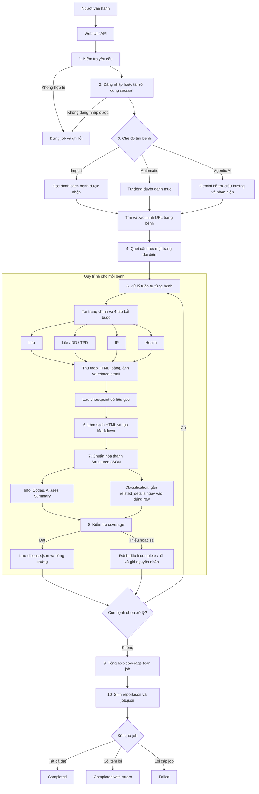
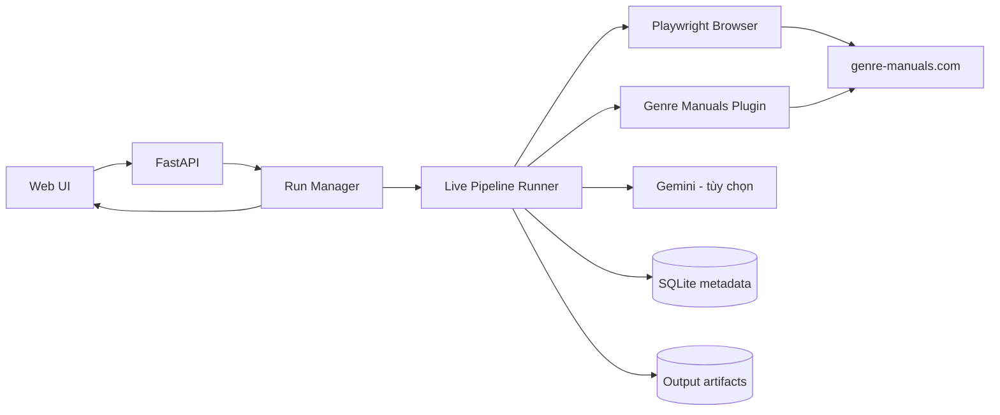
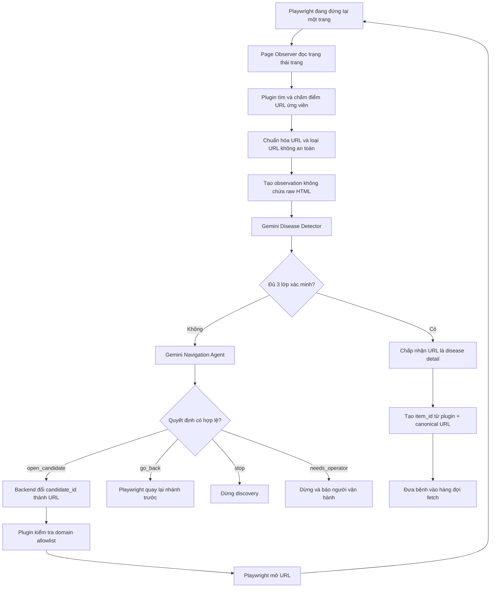
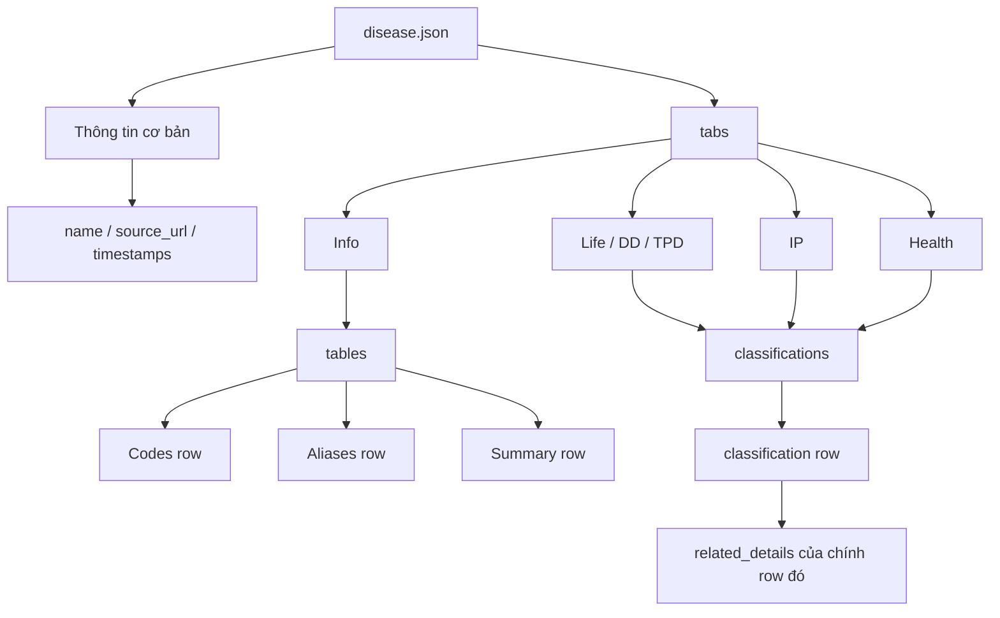

# Sơ đồ hoạt động của công cụ Crawl dữ liệu bệnh

## 1. Tóm tắt dành cho quản lý

Công cụ nhận danh sách bệnh hoặc tự tìm bệnh trên `genre-manuals.com`, đăng nhập bằng phiên trình duyệt được cấp quyền, thu thập dữ liệu từ bốn tab bắt buộc, chuẩn hóa dữ liệu thành JSON, kiểm tra độ đầy đủ theo cơ chế **fail-closed**, sau đó lưu toàn bộ bằng chứng và báo cáo theo từng job.



## 2. Kiến trúc tổng thể



Vai trò của các thành phần:

| Thành phần | Trách nhiệm chính |
|---|---|
| Web UI / API | Nhận cấu hình, khởi chạy job và hiển thị tiến độ |
| Run Manager | Xếp hàng, quản lý trạng thái và bảo đảm chỉ có một crawler chạy tại một thời điểm |
| Live Pipeline Runner | Điều phối toàn bộ các stage của job |
| Playwright + Plugin | Đăng nhập, điều hướng, mở tab, tải popup và thu thập dữ liệu nguồn |
| Cleaner / Parser | Làm sạch nội dung và chuyển sang cấu trúc JSON thống nhất |
| Coverage Validator | Kiểm tra các tab, bảng, trường và bằng chứng bắt buộc |
| Artifact Store / SQLite | Lưu checkpoint, dữ liệu đầu ra, trạng thái và báo cáo |
| Gemini | Tùy chọn; hỗ trợ discovery hoặc normalization, không thay thế dữ liệu nguồn |

## 3. Gemini điều hướng và phát hiện URL cần crawl như thế nào?

### 3.1. Nguyên tắc thiết kế

Gemini **không được tự nhập hoặc mở một URL bất kỳ**. Backend luôn thu thập và kiểm tra trước một danh sách URL ứng viên; Gemini chỉ được trả về `candidate_id` có trong danh sách đó. Playwright mới là thành phần thực hiện lệnh điều hướng sau khi quyết định đã vượt qua các guard của backend.



### 3.2. Dữ liệu gửi vào Gemini

`PageObserver` tạo một snapshot giới hạn và không gửi raw DOM/HTML vào prompt:

| Field | Nội dung và giới hạn |
|---|---|
| `canonical_url` | URL đã chuẩn hóa |
| `title` | Tiêu đề trang, tối đa 1.000 ký tự |
| `breadcrumb` | Đường dẫn menu hiện tại |
| `headings` | Tối đa 40 heading `h1`–`h4` |
| `main_text_excerpt` | Text sạch trong vùng nội dung, tối đa 30.000 ký tự |
| `medical_section_markers` | Các tín hiệu như causes, diagnosis, symptoms, treatment |
| `links` | Tối đa 80 URL ứng viên, mỗi URL có `candidate_id`, label và rule score |
| `page_fingerprint` | SHA-256 của trạng thái trang để phát hiện vòng lặp |
| `visited_candidate_ids` | Các candidate đã đi qua, không được chọn lại |
| `remaining_hops` | Số bước điều hướng còn lại |

### 3.3. Prompt được tạo và gửi sang Gemini như thế nào?

Backend không viết một prompt tự do cho toàn bộ job. Mỗi nhiệm vụ có một template riêng, có version và schema output riêng. Mỗi model call được ghép theo đúng cấu trúc:

```text
<INSTRUCTION_TEMPLATE của agent>

INPUT_JSON:
<JSON runtime đã kiểm tra an toàn và serialize>
```

Sau đó backend gọi Gemini với:

```text
model           = model được cấu hình cho từng agent
temperature     = 0
response_schema = Pydantic schema bắt buộc của agent
```

Gemini không được trả văn bản tự do. Response phải validate được bằng schema; nếu sai type, thiếu field, chọn ID không tồn tại hoặc đưa evidence không có trong nguồn thì backend từ chối response. Audit lưu prompt version, input/output hash, latency và token usage, nhưng không lưu credential trong prompt.

#### 3.3.1. Prompt Navigation Agent

Phần instruction cốt lõi, rút gọn sát với template `navigation_v1.md`:

```text
Select the next safe action for finding a specific disease-detail page.

Rules:
- Select only a candidate_id present in the observation.
- Never invent, edit, or return a URL.
- Prefer disease links over category, listing and pagination links.
- Do not select a visited candidate.
- On a disease-detail page, go_back while hops remain so another branch
  can be explored.
- Use stop only when backtracking cannot make progress.
- Never submit a form, credential, cookie or authentication value.
- Return only the requested structured decision; no chain-of-thought.
```

Ví dụ `INPUT_JSON` được nối vào cuối instruction:

```json
{
  "prompt_version": "1.0.0",
  "observation": {
    "canonical_url": "https://www.genre-manuals.com/en_cardiac_arrhythmias.htm",
    "title": "Cardiac arrhythmias",
    "breadcrumb": ["Medical", "Ratings", "Circulatory system", "Heart"],
    "headings": ["Cardiac arrhythmias"],
    "main_text_excerpt": "...clean text...",
    "medical_section_markers": [],
    "links": [
      {
        "candidate_id": "candidate-a14f...",
        "label": "Brugada syndrome",
        "url": "https://www.genre-manuals.com/brugada_syndrome.htm",
        "dom_region": "medical_navigation",
        "rule_score": 0.95
      }
    ],
    "page_fingerprint": "sha256..."
  },
  "visited_candidate_ids": [],
  "remaining_hops": 10
}
```

Schema response bắt buộc:

```json
{
  "action": "open_candidate",
  "candidate_id": "candidate-a14f...",
  "confidence": 0.97,
  "reason_code": "disease_candidate"
}
```

Backend lấy URL thật từ mapping nội bộ `candidate_id → URL`; Gemini không cung cấp URL cho lệnh browser. Nếu ID không có trong observation, ID đã truy cập hoặc `remaining_hops=0`, lệnh bị từ chối.

#### 3.3.2. Prompt Disease Detector

Detector nhận observation nhưng **loại field `links`**, vì nhiệm vụ của nó chỉ là kết luận trang hiện tại có phải một bệnh cụ thể hay không.

```text
Determine whether the clean observation describes one specific disease.

Rules:
- Distinguish disease detail from list, menu, guideline, calculator,
  questionnaire, login, blocked, error and empty pages.
- Use only facts in the supplied observation.
- Do not use medical knowledge from memory.
- A positive decision requires a disease name and verbatim evidence.
- Evidence must occur in title, headings or clean text.
- Insufficient content must return is_disease_detail=false.
- Return only the requested structured decision.
```

Ví dụ response dương tính:

```json
{
  "is_disease_detail": true,
  "confidence": 0.96,
  "disease_name": "Brugada syndrome / Brugada pattern ECG",
  "evidence": [
    "Brugada syndrome / Brugada pattern ECG"
  ],
  "negative_signals": [],
  "reason_code": "confirmed_detail"
}
```

Backend normalize rồi tìm từng chuỗi trong `evidence` bên trong title, headings và clean text. Chỉ khi evidence tồn tại nguyên văn và confidence đạt `0.85` thì kết quả Gemini mới được dùng.

#### 3.3.3. Prompt chọn autocomplete khi import

Với tên bệnh import, Gemini chỉ so sánh tên được nhập với danh sách gợi ý website đã trả về:

```json
{
  "prompt_version": "1.0.0",
  "imported_name": "Systemic lupus erythematosus / SLE",
  "suggestions": [
    {
      "candidate_id": "suggestion-01",
      "label": "Systemic lupus erythematosus"
    },
    {
      "candidate_id": "suggestion-02",
      "label": "Polyneuropathy due to systemic lupus erythematosus"
    }
  ]
}
```

Instruction ưu tiên exact match sau khi chuẩn hóa chữ hoa/thường, dấu câu và khoảng trắng; cho phép singular/plural; không được chọn triệu chứng, điều trị hoặc bệnh chỉ có liên quan. Nếu mơ hồ phải trả nhiều ID với reason `ambiguous`; nếu không có gợi ý phù hợp phải trả danh sách rỗng với reason `no_suitable_suggestion`.

Ví dụ response:

```json
{
  "selected_candidate_ids": ["suggestion-01"],
  "confidence": 0.98,
  "reason_code": "exact_name",
  "reason": "Tên gợi ý khớp trực tiếp với tên bệnh được import."
}
```

Các ID được Gemini chọn vẫn phải nằm trong suggestions ban đầu. Sau bước này, website được mở và URL vẫn phải vượt qua page classifier cùng Disease Detector; chọn đúng autocomplete chưa đủ để công nhận đó là trang bệnh.

### 3.4. Cách tạo và lọc URL ứng viên

Plugin thực hiện các bước deterministic trước khi Gemini nhìn thấy URL:

1. Đọc link trong nhánh `Medical → Ratings`, menu hiện tại và các link điều hướng nội dung.
2. Chuyển relative URL thành absolute URL bằng URL của trang hiện tại.
3. Chỉ giữ scheme `http/https` và domain `genre-manuals.com` hoặc `www.genre-manuals.com`.
4. Loại link logout, privacy, calculator, questionnaire, financial, travel và các vùng không phải medical content.
5. Chuẩn hóa URL: viết thường scheme/domain, bỏ fragment và tham số `utm_*`, sắp xếp query, bỏ dấu `/` cuối không cần thiết.
6. Loại URL hiện tại, URL đã truy cập và URL trùng canonical URL.
7. Chấm điểm rule-based, ví dụ trang `/en_*.htm` được ưu tiên cao; nhánh `Medical/Ratings` và link có từ khóa disease/medical/conditions được ưu tiên tiếp theo.
8. Tạo `candidate_id = SHA-256(current_page_url + candidate_url)` rút gọn. Gemini chỉ nhìn thấy và chọn ID này.

### 3.5. Ba lớp xác minh một URL là trang bệnh

Một URL chỉ được nhận vào hàng đợi khi đồng thời đạt cả ba lớp:

| Lớp | Điều kiện bắt buộc |
|---|---|
| Rule-based page classifier | Có title, nội dung tối thiểu, đủ bốn tab `Info`, `Life/DD/TPD`, `IP`, `Health` và tổng confidence đạt ngưỡng cấu hình |
| Gemini Disease Detector | Trả `is_disease_detail=true`, có tên bệnh, reason `confirmed_detail` và confidence tối thiểu `0.85` |
| Grounding guard | Mọi evidence Gemini đưa ra phải xuất hiện nguyên văn trong title, heading hoặc clean text của observation |

Prompt detector yêu cầu phân biệt trang bệnh với menu, danh sách, guideline, calculator, questionnaire, login, CAPTCHA, error và empty page. Gemini không được dùng kiến thức y khoa từ bộ nhớ để suy đoán trang bệnh.

Sau khi đạt ba lớp, hệ thống canonicalize URL lần cuối, tạo `item_id` ổn định từ `plugin + canonical_url`, loại trùng theo `item_id`, rồi mới chuyển URL sang bước fetch bốn tab.

### 3.6. Gemini parsing là lựa chọn độc lập

`Agentic Discovery` chỉ quyết định đường đi và xác minh URL. `Agentic Parsing` là tùy chọn riêng để tạo `disease.json` từ Markdown/text đã làm sạch. Khi bật parsing AI:

- Prompt extraction cấm dùng kiến thức bên ngoài và yêu cầu `value` cùng `source_quote` xuất hiện nguyên văn trong nguồn.
- Timeout mỗi lần là 90 giây; hệ thống thử tối đa ba lần với backoff.
- Nếu Gemini vẫn gặp lỗi tạm thời, deterministic parser tiếp quản và output có warning `agentic_extraction_fallback:transient_failure`.

Prompt extraction được ghép theo cùng cấu trúc instruction + `INPUT_JSON`. Payload chỉ gồm URL nguồn, title, headings, Markdown, plain text và content hash sau BeautifulSoup; raw HTML bị cấm.

Ví dụ phần instruction quan trọng:

```text
Extract disease fields only from BeautifulSoup-cleaned Markdown and text.
- Never use external knowledge, model memory or assumptions.
- value and source_quote must be verbatim substrings in the input.
- Preserve complete sentences, lists, numbers, units and qualifications.
- Missing scalar fields are null; missing list fields are empty lists.
- Raw HTML/DOM is forbidden.
```

Ví dụ một phần structured response:

```json
{
  "name": {
    "value": "Aortic dilatation",
    "source_quote": "Aortic dilatation",
    "source_section": "Title"
  },
  "summary": {
    "value": "Aortic dilatation refers to the abnormal enlargement of the aorta, the largest blood vessel in the body.",
    "source_quote": "Aortic dilatation refers to the abnormal enlargement of the aorta, the largest blood vessel in the body.",
    "source_section": "Summary"
  },
  "aliases": [],
  "causes": [],
  "risk_factors": [],
  "symptoms": [],
  "diagnosis": [],
  "treatment": [],
  "prevention": [],
  "prognosis": null,
  "when_to_seek_care": []
}
```

Sau response, grounding guard kiểm tra mọi `source_quote`; nếu quote không nằm trong clean source, hệ thống gửi một grounding-repair prompt lần hai. Nếu vẫn sai contract thì deterministic extraction được dùng thay thế, không cho nội dung không có căn cứ đi vào `disease.json`.

## 4. Cách tính coverage và performance của một lần crawl

### 4.1. Coverage của một bệnh

Coverage là kết quả **đạt/không đạt**, không phải điểm cộng có trọng số. Mỗi bệnh phải vượt qua toàn bộ bảy check:

| Check trong `coverage.json` | Cách kiểm tra |
|---|---|
| `main_content_present` | Có raw HTML và có section trong `disease.json` |
| `required_tabs_captured` | Có đúng và đầy đủ bốn tab bắt buộc, mỗi tab available và có HTML |
| `tabs_mapped_to_output` | Mỗi raw tab có clean tab và output tab tương ứng; tab có dữ liệu không được rỗng sau clean |
| `tables_preserved` | Từng row/cell của bảng nguồn vẫn tồn tại sau khi canonicalize chữ thường và khoảng trắng |
| `classification_hierarchy_preserved` | Tab rating có `conditionTable` phải tạo được classification tree và row |
| `related_details_preserved` | Popup/link detail khả dụng phải còn text và được ánh xạ sang output |
| `structured_fields_complete` | Field có nhãn thực sự tồn tại trong nguồn phải được parser trích xuất |

Công thức của một item:

```text
item_complete = ALL(check_1 ... check_7) AND blockers is empty
```

Field tùy chọn không xuất hiện trong nguồn chỉ sinh warning `field_not_present_in_source:*`; nó không làm coverage fail. Ngược lại, field có trong nguồn nhưng parser bỏ sót tạo blocker `source_field_not_extracted:*` và item bị chuyển thành `retryable_failed` với mã `COVERAGE_INCOMPLETE`.

### 4.2. Coverage của toàn job

```text
coverage_rate (%) = complete_items / checked_items × 100
coverage_failed   = checked_items - complete_items
job_coverage_ok   = checked_items > 0 AND complete_items = checked_items
```

Job chỉ có `coverage_complete=true` khi mọi item đã đi vào bước coverage đều đạt. Item lỗi từ fetch/clean/parse không vào mẫu số `checked_items`; chúng được phản ánh riêng qua `failed_items` và làm trạng thái cuối thành `completed_with_errors`.

### 4.3. Các chỉ số performance nên báo cáo

Hệ thống chưa lưu một field duy nhất tên `performance_score`. Performance của một lần crawl được tính từ `import-search.json`, `report.json`, `coverage-report.json`, timestamp trong database và audit Gemini:

| KPI | Công thức |
|---|---|
| Discovery match rate | `matched_input_names / requested_input_names × 100` |
| Crawl/parse success rate | `successful_items / total_discovered_items × 100` |
| Coverage pass rate | `coverage_complete_items / coverage_checked_items × 100` |
| End-to-end failure rate | `failed_items / total_discovered_items × 100` |
| Elapsed time | `finished_at - started_at` |
| Throughput | `successful_items / elapsed_minutes` |
| Expansion factor | `total_discovered_items / matched_input_names` |
| Checkpoint reuse rate | `unchanged_items / total_discovered_items × 100` |
| Change rate | `(new_items + updated_items) / total_discovered_items × 100` |
| AI calls | Tổng record trong `model_calls` của job |
| AI tokens | `SUM(input_tokens) + SUM(output_tokens)` |
| Tokens per successful item | `AI tokens / successful_items` |

Không nên dùng riêng `successful_items / requested_input_names`, vì một tên import có thể mở rộng thành nhiều trang bệnh con. Hai KPI cần trình bày riêng là **tỷ lệ resolve tên đầu vào** và **số trang bệnh đầu ra thực tế**.

### 4.4. Ví dụ thực tế của một lần crawl

Ví dụ job `1dedbad5-c5f2-4fc2-b9f2-a411fb7782e3`:

| Chỉ số | Giá trị | Phép tính |
|---|---:|---|
| Tên import | 25 | Input của job |
| Tên resolve được | 25 | `25 / 25 = 100%` discovery match rate |
| Trang bệnh phát hiện | 37 | Có mở rộng bệnh con; expansion factor `37 / 25 = 1,48` |
| Crawl + parse thành công | 37 | `37 / 37 = 100%` |
| Coverage đạt | 37 | `37 / 37 = 100%` |
| Item lỗi | 0 | Failure rate `0%` |
| Thời gian | 643,85 giây | Khoảng 10 phút 44 giây |
| Throughput | 3,45 bệnh/phút | `37 / (643,85 / 60)` |
| Gemini API calls | 37 | Audit `model_calls` của job |
| Gemini tokens | 90.286 | 55.122 input + 35.164 output |
| Token/bệnh | Khoảng 2.440 | `90.286 / 37` |

Ví dụ này cho thấy một job có thể nhận 25 tên nhưng tạo 37 disease output do category expansion. Coverage 100% cho biết 37 output đều bảo toàn các thành phần nguồn bắt buộc; nó không có nghĩa 100% tên trong một danh sách khác ngoài input của chính job đã được tìm thấy.

### 4.5. Báo cáo token cho toàn bộ đợt chạy 80 tên bệnh

Đợt chạy hiện tại nhận **80 tên bệnh đầu vào**, được chia thành bốn batch do mỗi job hỗ trợ tối đa 25 tên. Kết quả discovery và output:

| Chỉ số | Kết quả |
|---|---:|
| Tên bệnh đầu vào | 80 |
| Tên resolve được | 66 — `82,5%` |
| Tên chưa tìm được | 14 — `17,5%` |
| Disease output thành công qua các batch | 96 |
| Disease output duy nhất sau loại trùng URL/item ID | 94 |
| Item lỗi xử lý ở các job hoàn tất | 0 |

Token được cộng từ audit `model_calls` của bốn job hoàn tất và job nguồn của batch đầu. Job nguồn phải được tính vì lần chạy lại đã tái sử dụng 32 disease output từ checkpoint của job đó:

| Lần chạy | Gemini calls ghi nhận | Input tokens | Output tokens | Tổng tokens |
|---|---:|---:|---:|---:|
| Batch 1 — job nguồn ban đầu | 34 | 53.799 | 33.755 | 87.554 |
| Batch 1 — chạy lại bốn item timeout | 4 | 5.749 | 3.648 | 9.397 |
| Batch 2 | 21 | 25.921 | 16.665 | 42.586 |
| Batch 3 | 37 | 55.122 | 35.164 | 90.286 |
| Batch 4 | 3 | 5.213 | 3.429 | 8.642 |
| **Tổng cộng** | **99** | **145.804** | **92.661** | **238.465** |

Các chỉ số quy đổi:

```text
Token / tên đầu vào       = 238.465 / 80 = 2.980,81
Token / tên resolve được  = 238.465 / 66 = 3.613,11
Token / disease duy nhất  = 238.465 / 94 = 2.536,86
```

Vì vậy, số nên dùng khi báo cáo cho đợt 80 tên là **ít nhất 238.465 tokens**, trung bình khoảng **2.537 tokens cho mỗi disease output duy nhất**.

Đây là số đo từ usage metadata được lưu trong database, không phải hóa đơn từ nhà cung cấp. Bốn Gemini request từng bị timeout ở lần chạy đầu không ghi được usage metadata, nên chi phí token thực tế phía Gemini có thể cao hơn một chút. Con số **150.911 tokens** nếu chỉ cộng bốn job hoàn tất là chưa đủ, vì bỏ sót 87.554 tokens của các output đã được checkpoint reuse từ job nguồn.

## 5. Mười giai đoạn xử lý

| # | Stage hệ thống | Hoạt động | Kết quả chính |
|---:|---|---|---|
| 1 | `validate` | Kiểm tra URL, domain, quyền crawl, giới hạn và cấu hình AI | Yêu cầu hợp lệ |
| 2 | `authenticate` | Đăng nhập hoặc tái sử dụng session trình duyệt | Phiên truy cập hợp lệ |
| 3 | `navigate` | Truy cập website và chuẩn bị điều hướng | Trang nguồn sẵn sàng |
| 4 | `discover` | Tìm, đối chiếu và xác minh các trang bệnh | Danh sách URL bệnh |
| 5 | `profile` | Quét một trang đại diện để nhận diện cấu trúc nguồn | `site-profile.json` |
| 6 | `fetch` | Tải trang chính, bốn tab và related detail | Dữ liệu gốc + ảnh chụp |
| 7 | `clean` | Loại bỏ thành phần nhiễu, chuẩn hóa text, bảng và Markdown | `content.html`, `markdown.md`, `tabs.json` |
| 8 | `parse` | Ánh xạ dữ liệu sang schema bệnh; có thể dùng AI normalization | `disease.json` |
| 9 | `coverage` | Kiểm tra độ đầy đủ và liên kết dữ liệu với nguồn | `coverage.json` |
| 10 | `report` | Tổng hợp kết quả toàn job và các lỗi còn lại | `report.json`, `coverage-report.json` |

## 6. Cấu trúc dữ liệu đầu ra quan trọng

Phiên bản định dạng hiện tại của `disease.json` là schema `1.3`. Dữ liệu được tổ chức để thuận tiện cho việc chunking về sau:



Điểm chính của định dạng:

- `Codes`, `Aliases` và `Summary` nằm trong `Info → tables → rows`, giúp mỗi nội dung trở thành một đơn vị chunk rõ ràng.
- Nội dung chú thích từ popup/link được gắn vào `related_details` của đúng classification row chứa link đó.
- `tabs[].related_details` vẫn được giữ như danh sách tổng hợp để tương thích và truy xuất toàn tab.
- Mỗi item giữ lại dữ liệu nguồn và ảnh chụp để có thể kiểm chứng kết quả đã chuẩn hóa.

## 7. Cây thư mục đầu ra

```text
output/jobs/{job_id}/
├── job.json
├── report.json
├── site-profile.json
├── coverage-report.json
└── items/{disease-slug}/
    ├── manifest.json
    ├── raw.html
    ├── content.html
    ├── tabs-raw.json
    ├── tabs.json
    ├── markdown.md
    ├── disease.json
    ├── coverage.json
    ├── screenshot.png
    └── disease-*.json        # Dữ liệu trung gian khi bật AI normalization
```

## 8. Cơ chế kiểm soát chất lượng và an toàn

- **Fail-closed coverage:** item thiếu dữ liệu bắt buộc không được coi là thành công hoàn chỉnh.
- **Checkpoint theo stage:** có thể tái sử dụng dữ liệu `raw`, `clean` hoặc `parsed` hợp lệ khi chạy phục hồi.
- **Lưu bằng chứng:** HTML gốc, Markdown, JSON trung gian và screenshot hỗ trợ kiểm tra ngược.
- **Cô lập lỗi theo item:** một bệnh lỗi không làm mất kết quả của toàn bộ các bệnh đã crawl thành công.
- **Báo cáo minh bạch:** lỗi, warning và coverage của từng item được tổng hợp ở cấp job.
- **Giới hạn đồng thời:** hệ thống chỉ cho một crawler thực thi tại một thời điểm để tránh xung đột session và tài nguyên.
- **AI là tùy chọn:** kết quả AI phải bám dữ liệu nguồn; nội dung không có căn cứ bị từ chối bởi bước kiểm tra.
- **Không vượt CAPTCHA hoặc cơ chế bảo vệ:** job dừng và báo lỗi khi không thể truy cập hợp lệ.

## 9. Trạng thái kết thúc của job

| Trạng thái | Ý nghĩa |
|---|---|
| `completed` | Tất cả item đã xử lý và đạt kiểm tra bắt buộc |
| `completed_with_errors` | Job hoàn tất nhưng còn một hoặc nhiều item lỗi/thiếu dữ liệu |
| `failed` | Job gặp lỗi cấp hệ thống hoặc không thể tiếp tục pipeline |

## 10. Nội dung trình bày nhanh trong 60 giây

> Công cụ tự động đăng nhập và tìm các trang bệnh theo danh sách import, chế độ tự động hoặc chế độ AI hỗ trợ. Với mỗi bệnh, hệ thống tải đầy đủ bốn tab cùng các popup chú thích, lưu dữ liệu gốc làm bằng chứng, sau đó làm sạch và chuẩn hóa về một schema JSON thống nhất. Trước khi công nhận kết quả, hệ thống kiểm tra coverage theo nguyên tắc fail-closed. Cuối cùng, toàn bộ kết quả, lỗi và mức độ đầy đủ được tổng hợp thành báo cáo theo job. Thiết kế checkpoint giúp chạy lại hiệu quả, còn cấu trúc row-level `related_details` và các row `Codes/Aliases/Summary` giúp dữ liệu sẵn sàng cho chunking và các bước xử lý tiếp theo.
