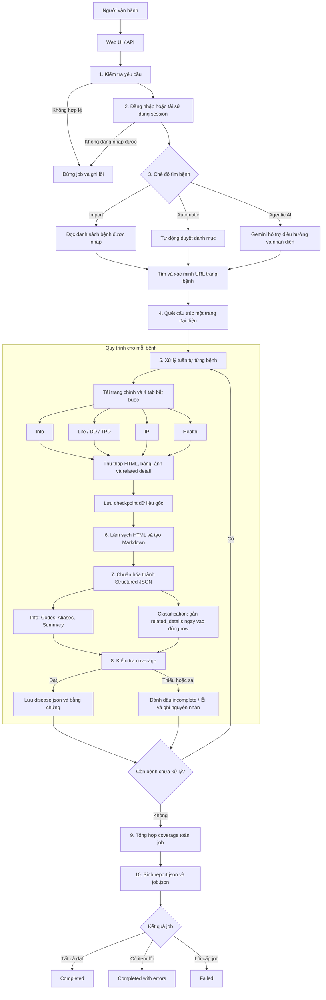
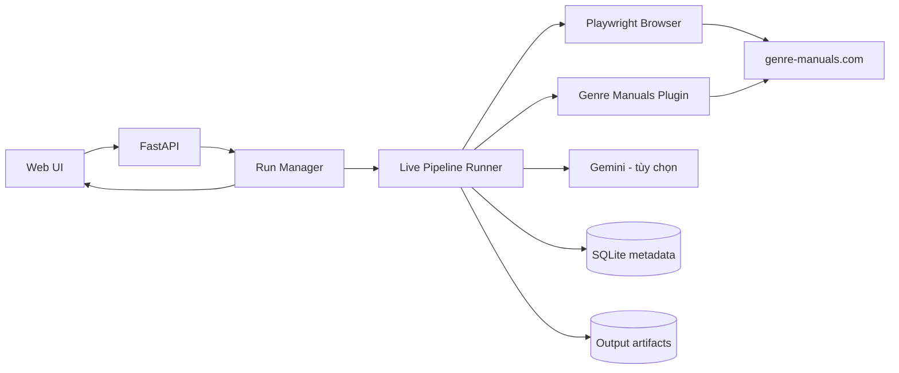
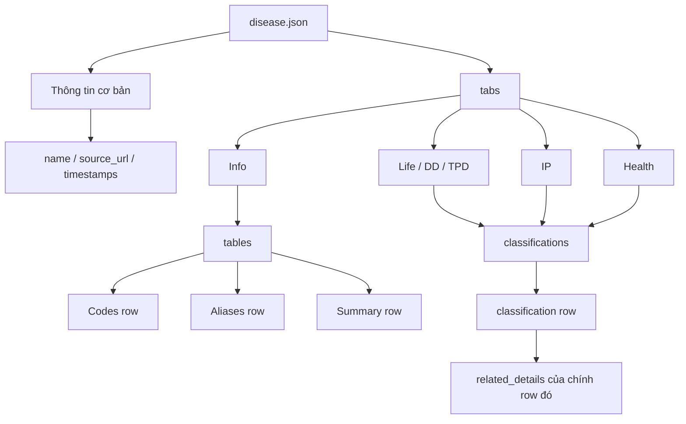

# Sơ đồ hoạt động của công cụ Crawl dữ liệu bệnh

## 1. Tóm tắt dành cho quản lý

Công cụ nhận danh sách bệnh hoặc tự tìm bệnh trên `genre-manuals.com`, đăng nhập bằng phiên trình duyệt được cấp quyền, thu thập dữ liệu từ bốn tab bắt buộc, chuẩn hóa dữ liệu thành JSON, kiểm tra độ đầy đủ theo cơ chế **fail-closed**, sau đó lưu toàn bộ bằng chứng và báo cáo theo từng job.



## 2. Kiến trúc tổng thể



Vai trò của các thành phần:

| Thành phần | Trách nhiệm chính |
|---|---|
| Web UI / API | Nhận cấu hình, khởi chạy job và hiển thị tiến độ |
| Run Manager | Xếp hàng, quản lý trạng thái và bảo đảm chỉ có một crawler chạy tại một thời điểm |
| Live Pipeline Runner | Điều phối toàn bộ các stage của job |
| Playwright + Plugin | Đăng nhập, điều hướng, mở tab, tải popup và thu thập dữ liệu nguồn |
| Cleaner / Parser | Làm sạch nội dung và chuyển sang cấu trúc JSON thống nhất |
| Coverage Validator | Kiểm tra các tab, bảng, trường và bằng chứng bắt buộc |
| Artifact Store / SQLite | Lưu checkpoint, dữ liệu đầu ra, trạng thái và báo cáo |
| Gemini | Tùy chọn; hỗ trợ discovery hoặc normalization, không thay thế dữ liệu nguồn |

## 3. Mười giai đoạn xử lý

| # | Stage hệ thống | Hoạt động | Kết quả chính |
|---:|---|---|---|
| 1 | `validate` | Kiểm tra URL, domain, quyền crawl, giới hạn và cấu hình AI | Yêu cầu hợp lệ |
| 2 | `authenticate` | Đăng nhập hoặc tái sử dụng session trình duyệt | Phiên truy cập hợp lệ |
| 3 | `navigate` | Truy cập website và chuẩn bị điều hướng | Trang nguồn sẵn sàng |
| 4 | `discover` | Tìm, đối chiếu và xác minh các trang bệnh | Danh sách URL bệnh |
| 5 | `profile` | Quét một trang đại diện để nhận diện cấu trúc nguồn | `site-profile.json` |
| 6 | `fetch` | Tải trang chính, bốn tab và related detail | Dữ liệu gốc + ảnh chụp |
| 7 | `clean` | Loại bỏ thành phần nhiễu, chuẩn hóa text, bảng và Markdown | `content.html`, `markdown.md`, `tabs.json` |
| 8 | `parse` | Ánh xạ dữ liệu sang schema bệnh; có thể dùng AI normalization | `disease.json` |
| 9 | `coverage` | Kiểm tra độ đầy đủ và liên kết dữ liệu với nguồn | `coverage.json` |
| 10 | `report` | Tổng hợp kết quả toàn job và các lỗi còn lại | `report.json`, `coverage-report.json` |

## 4. Cấu trúc dữ liệu đầu ra quan trọng

Phiên bản định dạng hiện tại của `disease.json` là schema `1.3`. Dữ liệu được tổ chức để thuận tiện cho việc chunking về sau:



Điểm chính của định dạng:

- `Codes`, `Aliases` và `Summary` nằm trong `Info → tables → rows`, giúp mỗi nội dung trở thành một đơn vị chunk rõ ràng.
- Nội dung chú thích từ popup/link được gắn vào `related_details` của đúng classification row chứa link đó.
- `tabs[].related_details` vẫn được giữ như danh sách tổng hợp để tương thích và truy xuất toàn tab.
- Mỗi item giữ lại dữ liệu nguồn và ảnh chụp để có thể kiểm chứng kết quả đã chuẩn hóa.

## 5. Cây thư mục đầu ra

```text
output/jobs/{job_id}/
├── job.json
├── report.json
├── site-profile.json
├── coverage-report.json
└── items/{disease-slug}/
    ├── manifest.json
    ├── raw.html
    ├── content.html
    ├── tabs-raw.json
    ├── tabs.json
    ├── markdown.md
    ├── disease.json
    ├── coverage.json
    ├── screenshot.png
    └── disease-*.json        # Dữ liệu trung gian khi bật AI normalization
```

## 6. Cơ chế kiểm soát chất lượng và an toàn

- **Fail-closed coverage:** item thiếu dữ liệu bắt buộc không được coi là thành công hoàn chỉnh.
- **Checkpoint theo stage:** có thể tái sử dụng dữ liệu `raw`, `clean` hoặc `parsed` hợp lệ khi chạy phục hồi.
- **Lưu bằng chứng:** HTML gốc, Markdown, JSON trung gian và screenshot hỗ trợ kiểm tra ngược.
- **Cô lập lỗi theo item:** một bệnh lỗi không làm mất kết quả của toàn bộ các bệnh đã crawl thành công.
- **Báo cáo minh bạch:** lỗi, warning và coverage của từng item được tổng hợp ở cấp job.
- **Giới hạn đồng thời:** hệ thống chỉ cho một crawler thực thi tại một thời điểm để tránh xung đột session và tài nguyên.
- **AI là tùy chọn:** kết quả AI phải bám dữ liệu nguồn; nội dung không có căn cứ bị từ chối bởi bước kiểm tra.
- **Không vượt CAPTCHA hoặc cơ chế bảo vệ:** job dừng và báo lỗi khi không thể truy cập hợp lệ.

## 7. Trạng thái kết thúc của job

| Trạng thái | Ý nghĩa |
|---|---|
| `completed` | Tất cả item đã xử lý và đạt kiểm tra bắt buộc |
| `completed_with_errors` | Job hoàn tất nhưng còn một hoặc nhiều item lỗi/thiếu dữ liệu |
| `failed` | Job gặp lỗi cấp hệ thống hoặc không thể tiếp tục pipeline |

## 8. Nội dung trình bày nhanh trong 60 giây

> Công cụ tự động đăng nhập và tìm các trang bệnh theo danh sách import, chế độ tự động hoặc chế độ AI hỗ trợ. Với mỗi bệnh, hệ thống tải đầy đủ bốn tab cùng các popup chú thích, lưu dữ liệu gốc làm bằng chứng, sau đó làm sạch và chuẩn hóa về một schema JSON thống nhất. Trước khi công nhận kết quả, hệ thống kiểm tra coverage theo nguyên tắc fail-closed. Cuối cùng, toàn bộ kết quả, lỗi và mức độ đầy đủ được tổng hợp thành báo cáo theo job. Thiết kế checkpoint giúp chạy lại hiệu quả, còn cấu trúc row-level `related_details` và các row `Codes/Aliases/Summary` giúp dữ liệu sẵn sàng cho chunking và các bước xử lý tiếp theo.
