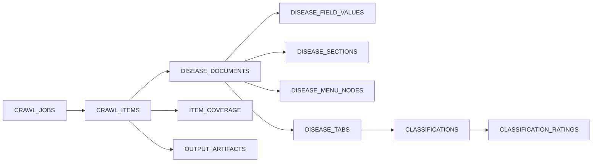

# Oracle crawler output ERD

## Relationship diagram

```mermaid
erDiagram
    CRAWL_JOBS ||--o{ CRAWL_ITEMS : contains
    CRAWL_JOBS ||--o{ OUTPUT_ARTIFACTS : produces
    CRAWL_ITEMS ||--o| DISEASE_DOCUMENTS : parsed_as
    CRAWL_ITEMS ||--o| ITEM_COVERAGE : validated_by
    CRAWL_ITEMS ||--o{ OUTPUT_ARTIFACTS : produces

    DISEASE_DOCUMENTS ||--o{ DISEASE_FIELD_VALUES : has
    DISEASE_DOCUMENTS ||--o{ DISEASE_SECTIONS : contains
    DISEASE_DOCUMENTS ||--o{ DISEASE_MENU_NODES : navigated_by
    DISEASE_DOCUMENTS ||--o{ DISEASE_TABS : has

    DISEASE_TABS ||--o{ TAB_TABLES : contains
    DISEASE_TABS ||--o{ TAB_RELATED_DETAILS : links_to
    DISEASE_TABS ||--o{ CLASSIFICATIONS : classifies
    CLASSIFICATIONS ||--o{ CLASSIFICATION_RATINGS : rated_by

    ITEM_COVERAGE ||--o{ COVERAGE_CHECKS : checks
    ITEM_COVERAGE ||--o{ COVERAGE_MESSAGES : explains

    CRAWL_JOBS {
        varchar2 job_id PK
        varchar2 plugin
        varchar2 status
        number stop_requested
        timestamp created_at
        timestamp started_at
        timestamp finished_at
    }

    CRAWL_ITEMS {
        varchar2 job_id PK,FK
        varchar2 item_id PK
        varchar2 source_url
        varchar2 canonical_url
        varchar2 canonical_url_hash
        varchar2 title
        varchar2 status
        varchar2 content_hash
        varchar2 snapshot_hash
        varchar2 baseline_job_id
        varchar2 change_status
        timestamp updated_at
    }

    DISEASE_DOCUMENTS {
        number doc_pk PK
        varchar2 job_id FK
        varchar2 item_id FK
        varchar2 document_id
        varchar2 schema_version
        varchar2 disease_name
        clob summary
        clob prognosis
        varchar2 canonical_url
        varchar2 content_hash
        clob document_json
    }

    DISEASE_FIELD_VALUES {
        number value_pk PK
        number doc_pk FK
        varchar2 field_name
        number value_order
        clob field_value
    }

    DISEASE_SECTIONS {
        number section_pk PK
        number doc_pk FK
        number section_order
        varchar2 heading
        number heading_level
        clob markdown
    }

    DISEASE_MENU_NODES {
        number menu_node_pk PK
        number doc_pk FK
        number node_level
        number distance_from_item
        varchar2 label
        varchar2 node_url
        number is_current
    }

    DISEASE_TABS {
        number tab_pk PK
        number doc_pk FK
        varchar2 tab_key
        varchar2 label
        varchar2 source_url
        number is_available
        clob plain_text
        clob markdown
        varchar2 content_hash
    }

    TAB_TABLES {
        number table_pk PK
        number tab_pk FK
        number table_order
        clob rows_json
    }

    TAB_RELATED_DETAILS {
        number detail_pk PK
        number tab_pk FK
        number detail_order
        varchar2 label
        varchar2 detail_url
        number is_available
        clob plain_text
        clob markdown
    }

    CLASSIFICATIONS {
        number class_row_pk PK
        number tab_pk FK
        number row_order
        varchar2 classification_id
        varchar2 parent_classification_id
        varchar2 classification_name
        number node_level
        number is_group
        varchar2 class_code
        clob path_json
    }

    CLASSIFICATION_RATINGS {
        number rating_pk PK
        number class_row_pk FK
        varchar2 rating_name
        varchar2 rating_value
        number rating_order
    }

    ITEM_COVERAGE {
        number coverage_pk PK
        varchar2 job_id FK
        varchar2 item_id FK
        varchar2 schema_version
        number is_complete
        timestamp checked_at
        clob coverage_json
    }

    COVERAGE_CHECKS {
        number coverage_pk PK,FK
        varchar2 check_name PK
        number passed
    }

    COVERAGE_MESSAGES {
        number message_pk PK
        number coverage_pk FK
        varchar2 message_type
        number message_order
        varchar2 message_code
    }

    OUTPUT_ARTIFACTS {
        number artifact_pk PK
        varchar2 job_id FK
        varchar2 item_id FK
        varchar2 artifact_name
        varchar2 file_name
        varchar2 media_type
        varchar2 sha256
        number byte_size
        clob text_content
        blob binary_content
    }
```

## Table relationship matrix

| Parent table | Child table | Cardinality | Foreign key | Purpose |
| --- | --- | --- | --- | --- |
| `CRAWL_JOBS` | `CRAWL_ITEMS` | 1 → N | `CRAWL_ITEMS.JOB_ID` | A job crawls many disease items. |
| `CRAWL_JOBS` | `OUTPUT_ARTIFACTS` | 1 → N | `OUTPUT_ARTIFACTS.JOB_ID` | Stores job reports, site profile, and coverage report. |
| `CRAWL_ITEMS` | `DISEASE_DOCUMENTS` | 1 → 0..1 | `(JOB_ID, ITEM_ID)` | A successfully parsed item has one document snapshot per job. |
| `CRAWL_ITEMS` | `ITEM_COVERAGE` | 1 → 0..1 | `(JOB_ID, ITEM_ID)` | One final coverage result per item. |
| `CRAWL_ITEMS` | `OUTPUT_ARTIFACTS` | 1 → N | `(JOB_ID, ITEM_ID)` | Stores raw HTML, JSON, Markdown, and screenshot. |
| `DISEASE_DOCUMENTS` | `DISEASE_FIELD_VALUES` | 1 → N | `DOC_PK` | Ordered aliases, causes, symptoms, diagnosis, treatment, etc. |
| `DISEASE_DOCUMENTS` | `DISEASE_SECTIONS` | 1 → N | `DOC_PK` | Human-readable Markdown sections. |
| `DISEASE_DOCUMENTS` | `DISEASE_MENU_NODES` | 1 → N | `DOC_PK` | Home-to-disease breadcrumb hierarchy. |
| `DISEASE_DOCUMENTS` | `DISEASE_TABS` | 1 → 1..4 | `DOC_PK` | Info, Life/DD/TPD, IP, and Health tabs. |
| `DISEASE_TABS` | `TAB_TABLES` | 1 → N | `TAB_PK` | General non-classification tables. |
| `DISEASE_TABS` | `TAB_RELATED_DETAILS` | 1 → N | `TAB_PK` | Related pages fetched from a tab. |
| `DISEASE_TABS` | `CLASSIFICATIONS` | 1 → N | `TAB_PK` | Flat hierarchy rows in original order. |
| `CLASSIFICATIONS` | `CLASSIFICATION_RATINGS` | 1 → N | `CLASS_ROW_PK` | Dynamic rating columns and values. |
| `ITEM_COVERAGE` | `COVERAGE_CHECKS` | 1 → N | `COVERAGE_PK` | Boolean result of each coverage rule. |
| `ITEM_COVERAGE` | `COVERAGE_MESSAGES` | 1 → N | `COVERAGE_PK` | Blockers and informational warnings. |

## Main data flow

The flat `CLASSIFICATIONS` rows are the stored source of truth for hierarchy.
Use `CLASSIFICATION_ID`, `PARENT_CLASSIFICATION_ID`, `NODE_LEVEL`, and
`ROW_ORDER` to rebuild the tree. `PATH_JSON` preserves the exact path captured
from the source page.
