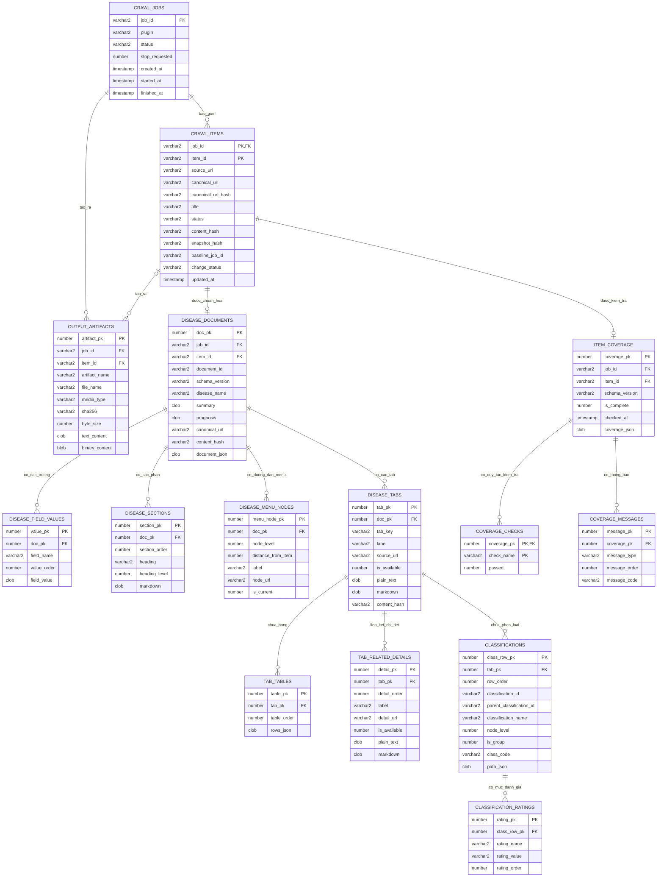
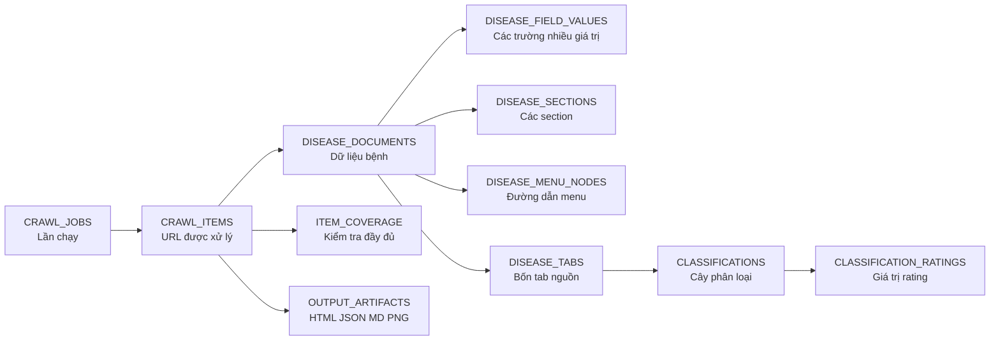

# Sơ đồ dữ liệu output crawler trên Oracle

Tài liệu này giải thích cách lưu toàn bộ kết quả crawler vào Oracle, bao gồm
trạng thái job, dữ liệu bệnh đã chuẩn hóa, bốn tab nguồn, cây phân loại,
coverage và các file artifact.

Tên bảng và tên cột được giữ bằng tiếng Anh để khớp chính xác với file DDL
`oracle_output_schema.sql`. Phần mô tả nghiệp vụ được trình bày bằng tiếng Việt.

## Cách đọc sơ đồ

- `PK` (Primary Key): khóa chính, dùng để nhận diện duy nhất một bản ghi.
- `FK` (Foreign Key): khóa ngoại, liên kết đến bản ghi ở bảng cha.
- `1 → N`: một bản ghi cha có thể có nhiều bản ghi con.
- `1 → 0..1`: một bản ghi cha có thể chưa có hoặc chỉ có một bản ghi con.
- `CLOB`: dữ liệu văn bản lớn, dùng cho HTML, Markdown và JSON.
- `BLOB`: dữ liệu nhị phân, dùng cho ảnh screenshot.
- Ký hiệu `||--o{` trong Mermaid biểu diễn quan hệ một-nhiều.
- Ký hiệu `||--o|` biểu diễn quan hệ một-không hoặc một-một.

## Sơ đồ quan hệ tổng thể

## Vai trò của từng nhóm bảng

### 1. Job và item được crawl

`CRAWL_JOBS` lưu một lần chạy crawler. Mỗi lần người vận hành bấm chạy sẽ tạo
một `JOB_ID`. Trạng thái job có thể là đang chạy, hoàn tất, hoàn tất một phần
hoặc thất bại.

`CRAWL_ITEMS` lưu từng URL mà job đã phát hiện và xử lý. Khóa chính là
`(JOB_ID, ITEM_ID)` vì cùng một bệnh có thể xuất hiện lại trong nhiều job. Các
cột hash và baseline dùng để nhận biết dữ liệu mới, thay đổi hoặc không đổi so
với lần crawl trước.

### 2. Tài liệu bệnh đã chuẩn hóa

`DISEASE_DOCUMENTS` là bảng trung tâm của output nghiệp vụ. Mỗi item parse
thành công có tối đa một document trong một job. Bảng lưu các trường thường
truy vấn như tên bệnh, tóm tắt, tiên lượng và đồng thời giữ nguyên toàn bộ
`disease.json` trong `DOCUMENT_JSON`.

`DOCUMENT_JSON` là bản dữ liệu không mất mát. Các bảng con là phiên bản tách
chuẩn hóa để có thể lọc, join và lập báo cáo bằng SQL.

`DISEASE_FIELD_VALUES` lưu những trường có nhiều giá trị theo đúng thứ tự, ví
dụ: aliases, causes, risk factors, symptoms, diagnosis, treatment, prevention
và when to seek care.

`DISEASE_SECTIONS` lưu các section Markdown với heading, cấp heading và thứ tự
hiển thị.

`DISEASE_MENU_NODES` lưu đường dẫn menu từ Home đến bệnh hiện tại. Ví dụ:
`Home → Medical → Ratings → Circulatory system → Heart → Hypertension`.

### 3. Bốn tab nguồn

`DISEASE_TABS` lưu tối đa bốn bản ghi cho mỗi document:

- `info`: nội dung thông tin bệnh;
- `life_dd_tpd`: bảng Life/DD/TPD;
- `ip`: bảng IP;
- `health`: bảng Health.

`TAB_TABLES` lưu các bảng thông thường không phải bảng classification. Mỗi bảng
được giữ theo thứ tự xuất hiện và lưu các hàng trong JSON.

`TAB_RELATED_DETAILS` lưu các trang chi tiết được liên kết từ một tab, bao gồm
URL, plain text, Markdown, trạng thái tải và content hash.

### 4. Cây classification và rating

`CLASSIFICATIONS` lưu cây phân loại dưới dạng các hàng phẳng. Cách này phù hợp
với Oracle và vẫn dựng lại được toàn bộ cây bằng các cột:

- `CLASSIFICATION_ID`: mã ổn định của node;
- `PARENT_CLASSIFICATION_ID`: mã node cha;
- `NODE_LEVEL`: cấp của node, bắt đầu từ 0;
- `ROW_ORDER`: vị trí gốc trong bảng nguồn;
- `PATH_JSON`: toàn bộ đường dẫn từ node gốc đến node hiện tại;
- `IS_GROUP`: phân biệt nhóm phân loại với dòng có rating thực tế.

`CLASSIFICATION_RATINGS` tách các cột rating động thành từng dòng. Ví dụ một
classification có thể có rating Life, DD, TPD hoặc các giá trị IP/Health khác
nhau mà không cần thay đổi cấu trúc bảng Oracle.

### 5. Kiểm tra coverage

`ITEM_COVERAGE` lưu kết quả coverage cuối cùng của một item và giữ nguyên
`coverage.json`.

`COVERAGE_CHECKS` lưu kết quả đạt/không đạt của từng quy tắc, ví dụ đủ bốn tab,
giữ nguyên bảng, giữ nguyên hierarchy và đủ nội dung chính.

`COVERAGE_MESSAGES` lưu hai loại thông báo:

- `blocker`: lỗi làm item không được xem là hoàn chỉnh;
- `warning`: thông tin cảnh báo không chặn kết quả.

### 6. File artifact

`OUTPUT_ARTIFACTS` lưu toàn bộ file đầu ra ở cấp job hoặc cấp item:

- CLOB: raw HTML, cleaned HTML, Markdown và các file JSON;
- BLOB: screenshot PNG;
- metadata: tên file, MIME type, SHA-256 và kích thước byte.

Khi `ITEM_ID` là `NULL`, artifact thuộc cấp job, ví dụ `report.json`,
`site-profile.json` hoặc `coverage-report.json`. Khi có `ITEM_ID`, artifact
thuộc một bệnh cụ thể.

## Ma trận quan hệ giữa các bảng

| Bảng cha | Bảng con | Số lượng | Khóa ngoại | Ý nghĩa |
| --- | --- | --- | --- | --- |
| `CRAWL_JOBS` | `CRAWL_ITEMS` | 1 → N | `CRAWL_ITEMS.JOB_ID` | Một job xử lý nhiều disease item. |
| `CRAWL_JOBS` | `OUTPUT_ARTIFACTS` | 1 → N | `OUTPUT_ARTIFACTS.JOB_ID` | Một job sinh report, site profile và coverage report. |
| `CRAWL_ITEMS` | `DISEASE_DOCUMENTS` | 1 → 0..1 | `(JOB_ID, ITEM_ID)` | Item parse thành công có một document snapshot trong job. |
| `CRAWL_ITEMS` | `ITEM_COVERAGE` | 1 → 0..1 | `(JOB_ID, ITEM_ID)` | Mỗi item có tối đa một kết quả coverage cuối cùng. |
| `CRAWL_ITEMS` | `OUTPUT_ARTIFACTS` | 1 → N | `(JOB_ID, ITEM_ID)` | Một item có raw HTML, JSON, Markdown và screenshot. |
| `DISEASE_DOCUMENTS` | `DISEASE_FIELD_VALUES` | 1 → N | `DOC_PK` | Các giá trị aliases, causes, symptoms, diagnosis, treatment... theo thứ tự. |
| `DISEASE_DOCUMENTS` | `DISEASE_SECTIONS` | 1 → N | `DOC_PK` | Các section Markdown có thể đọc trực tiếp. |
| `DISEASE_DOCUMENTS` | `DISEASE_MENU_NODES` | 1 → N | `DOC_PK` | Cây breadcrumb từ Home đến bệnh hiện tại. |
| `DISEASE_DOCUMENTS` | `DISEASE_TABS` | 1 → 1..4 | `DOC_PK` | Các tab Info, Life/DD/TPD, IP và Health. |
| `DISEASE_TABS` | `TAB_TABLES` | 1 → N | `TAB_PK` | Các bảng thông thường trong một tab. |
| `DISEASE_TABS` | `TAB_RELATED_DETAILS` | 1 → N | `TAB_PK` | Các trang chi tiết liên quan được tải từ tab. |
| `DISEASE_TABS` | `CLASSIFICATIONS` | 1 → N | `TAB_PK` | Các dòng classification theo đúng thứ tự nguồn. |
| `CLASSIFICATIONS` | `CLASSIFICATION_RATINGS` | 1 → N | `CLASS_ROW_PK` | Các tên và giá trị rating động của classification. |
| `ITEM_COVERAGE` | `COVERAGE_CHECKS` | 1 → N | `COVERAGE_PK` | Kết quả Boolean của từng quy tắc coverage. |
| `ITEM_COVERAGE` | `COVERAGE_MESSAGES` | 1 → N | `COVERAGE_PK` | Blocker và warning giải thích kết quả coverage. |

## Luồng ghi dữ liệu chính

Trình tự ghi được đề xuất:

1. Tạo `CRAWL_JOBS` khi bắt đầu một lần chạy.
2. Ghi `CRAWL_ITEMS` sau khi discovery xác nhận URL.
3. Sau khi parse thành công, ghi `DISEASE_DOCUMENTS` và toàn bộ bảng con trong
   cùng một transaction Oracle.
4. Ghi `ITEM_COVERAGE`, checks và messages sau khi coverage hoàn tất.
5. Ghi `OUTPUT_ARTIFACTS` cùng SHA-256 để có thể kiểm tra tính toàn vẹn.
6. Chỉ commit transaction khi document và các bảng con đã ghi đầy đủ.

## Nguyên tắc bảo toàn dữ liệu

- Không chỉ lưu các bảng chuẩn hóa; luôn giữ `DOCUMENT_JSON` làm bản gốc.
- Không chỉ lưu cây lồng nhau; giữ các hàng classification theo `ROW_ORDER`.
- Không suy diễn field không có trên nguồn thành dữ liệu rỗng bắt buộc.
- Dùng SHA-256 để phát hiện nội dung thay đổi và kiểm tra artifact.
- Khi xóa một job, các khóa ngoại `ON DELETE CASCADE` sẽ xóa dữ liệu con của
  đúng job đó.
- Việc ghi document, tabs, classification và coverage nên nằm trong một
  transaction để tránh trạng thái dữ liệu chỉ được lưu một phần.
